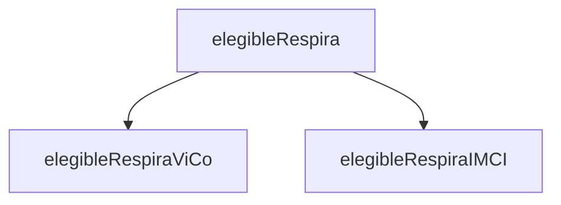
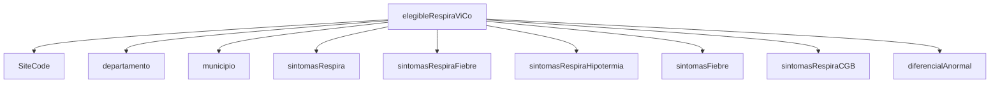
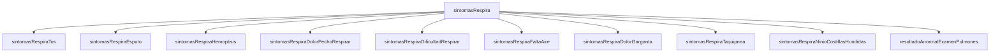
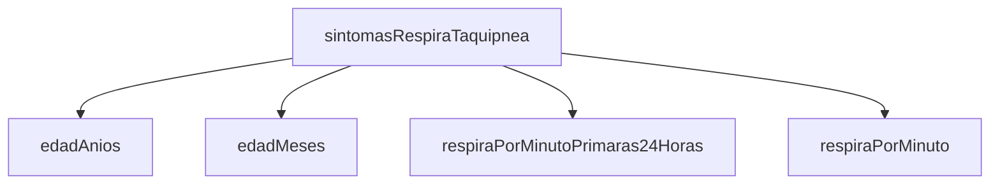
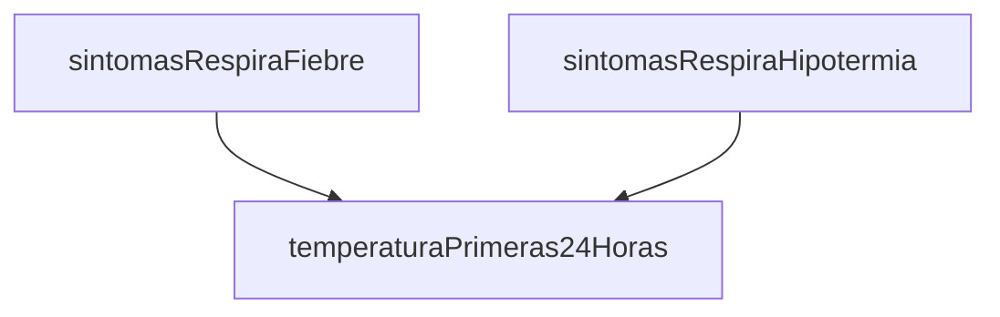
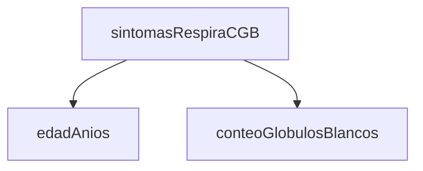

```mermaid
flowchart
  elegibleRespiraIMCI --> edadAnios
  elegibleRespiraIMCI --> edadMeses
  elegibleRespiraIMCI --> sintomasRespiraTaquipnea
  elegibleRespiraIMCI --> sintomasRespiraNinioCostillasHundidas
  elegibleRespiraIMCI --> sintomasRespiraTos
  elegibleRespiraIMCI --> sintomasRespiraDificultadRespirar
  elegibleRespiraIMCI --> sintomasRespiraNinioEstridor
  elegibleRespiraIMCI --> hipoxemia
  elegibleRespiraIMCI --> ninioCianosisObs
  elegibleRespiraIMCI --> ninioBeberMamar
  elegibleRespiraIMCI --> ninioVomitaTodo
  elegibleRespiraIMCI --> ninioTuvoConvulsiones
  elegibleRespiraIMCI --> ninioTuvoConvulsionesObs
  elegibleRespiraIMCI --> ninioTieneLetargiaObs
  elegibleRespiraIMCI --> ninioDesmayoObs
  elegibleRespiraIMCI --> ninioCabeceoObs
  elegibleRespiraIMCI --> ninioMovimientoObs
  elegibleRespiraIMCI --> ninioMovimientoObs
```

# elegibleRespira

This variable depends on `elegibleRespiraViCo` and `elegibleRespiraIMCI` alone.
If either case definition is met, then `elegibleRespira = 1`.

```vb
If
  elegibleRespiraViCo = 1 Or elegibleRespiraIMCI = 1
Then
  elegibleRespira = 1
Else
  elegibleRespira = 2
```




# elegibleRespiraViCo

ViCo case definition. `elegibleRespiraViCo = 1` when all the following is true:
1. Case originates from the catching area
2. At least one respiratory illnes sympthom is present
3. There's an indication of infection

```vb
If (
    ' Case found in Santa Rosa and originates from Santa Rosa, Jalapa or Jutiapa
    (SiteCode.StartsWith("06") And departamento in (6,21,22))
    Or
    ' Case found at Quetzaltenango and originates from the listed municipios
    (SiteCode.StartsWith("09") And municipio in (901,902,903,909,910,911,913,914,916,923))
  )

  ' At least one Respira sympthom is present
  And sintomasRespira = 1

  ' There's a sign of infection
  And (
       sintomasRespiraFiebre = 1
    Or sintomasRespiraHipotermia = 1
    Or sintomasFiebre = 1
    Or sintomasRespiraCGB = 1
    Or diferencialAnormal = 1
  )

Then
    elegibleRespiraViCo = 1
Else
    elegibleRespiraViCo = 2
```




# sintomasRespira

```vb
If
     sintomasRespiraTos = 1
  Or sintomasRespiraEsputo = 1
  Or sintomasRespiraHemoptisis = 1
  Or sintomasRespiraDolorPechoRespirar = 1
  Or sintomasRespiraDificultadRespirar = 1
  Or sintomasRespiraFaltaAire = 1
  Or sintomasRespiraDolorGarganta = 1
  Or sintomasRespiraTaquipnea = 1
  Or sintomasRespiraNinioCostillasHundidas = 1

  ' This variable is only available for hospitalized cases
  Or resultadoAnormalExamenPulmones = 1
Then
  sintomasRespira = 1
Else
  sintomasRespira = 2
```




# sintomasRespiraTaquipnea

```vb
If
  (edadAnios >= 5 And (respiraPorMinutoPrimaras24Horas >= 20 Or respiraPorMinuto >= 20))
  Or
  (edadAnios < 5  And edadAnios >= 1 And (respiraPorMinutoPrimaras24Horas >= 40 Or respiraPorMinuto >= 40))
  Or
  (edadAnios = 0  And edadMeses >= 2 And edadMeses <= 11 And (respiraPorMinutoPrimaras24Horas >= 50 Or respiraPorMinuto >= 50))
  Or
  (edadAnios = 0  And edadMeses < 2  And (respiraPorMinutoPrimaras24Horas >= 60 Or respiraPorMinuto >= 60))
Then
  sintomasRespiraTaquipnea = 1
Else
  sintomasRespiraTaquipnea = 2
```




# sintomasRespiraFiebre + sintomasRespiraHipotermia

This pair of variables are computed by the same code and evaluated at the same time

```vb
If temperaturaPrimeras24Horas >= 38.0 Then
  sintomasRespiraFiebre = 1
  sintomasRespiraHipotermia = 2
ElseIf temperaturaPrimeras24Horas < 35.5 Then
  sintomasRespiraFiebre = 2
  sintomasRespiraHipotermia = 1
ElseIf temperaturaPrimeras24Horas < 38.0 And temperaturaPrimeras24Horas >= 35.5 Then
  sintomasRespiraFiebre = 2
  sintomasRespiraHipotermia = 2
Else
  sintomasRespiraFiebre = Nothing
  sintomasRespiraHipotermia = Nothing
```




# sintomasRespiraCGB

```vb
If
  (edadAnios >= 5 And (conteoGlobulosBlancos < 3000 Or conteoGlobulosBlancos > 11000))
  Or
  (edadAnios < 5 And (conteoGlobulosBlancos < 5500 Or conteoGlobulosBlancos > 15000))
Then
  sintomasRespiraCGB = 1
Else
  sintomasRespiraCGB = 2
```




# elegibleRespiraIMCI

This case definition was introduced in 2013 to implement the recommendations
from WHO in their Integrated Management of Childhood Illness handbook (IMCI).

There are essentially two branches:

1. Kids under two months
2. Kids over two moths but under five years

```vb
If
  (edadAnios = 0 And edadMeses < 2)
  And
  (
    (sintomasRespiraTaquipnea = 1 Or sintomasRespiraNinioCostillasHundidas = 1)
    Or
    (
      (sintomasRespiraTos = 1 Or sintomasRespiraDificultadRespirar = 1)
      And
      (
           sintomasRespiraNinioEstridor = 1
        Or hipoxemia = 1
        Or ninioCianosisObs = 1
        Or ninioBeberMamar = 2
        Or ninioVomitaTodo = 1
        Or ninioTuvoConvulsiones = 1
        Or ninioTuvoConvulsionesObs = 1
        Or ninioTieneLetargiaObs = 1
        Or ninioDesmayoObs = 1
        Or ninioCabeceoObs = 1
        Or ninioMovimientoObs = 2
        Or ninioMovimientoObs = 3
      )
    )
  )
Then
  elegibleRespiraIMCI = 1

ElseIf
  (
    (edadAnios = 0 And edadMeses >= 2)
    Or
    (edadAnios > 0 And edadAnios < 5)
  )
  And
  (sintomasRespiraTos = 1 Or sintomasRespiraDificultadRespirar = 1)
  And
  (
       sintomasRespiraTaquipnea = 1
    Or sintomasRespiraNinioCostillasHundidas = 1
    Or sintomasRespiraNinioEstridor = 1
    Or hipoxemia = 1
    Or ninioCianosisObs = 1
    Or ninioBeberMamar = 2
    Or ninioVomitaTodo = 1
    Or ninioTuvoConvulsiones = 1
    Or ninioTuvoConvulsionesObs = 1
    Or ninioTieneLetargiaObs = 1
    Or ninioDesmayoObs = 1
    Or ninioCabeceoObs = 1
  )
Then
  elegibleRespiraIMCI = 1
Else
  elegibleRespiraIMCI = 2
```


