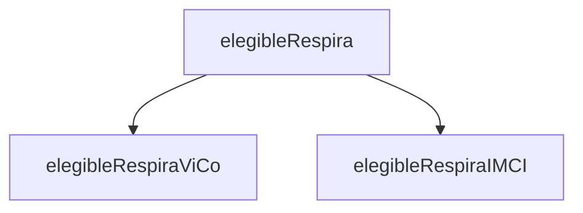

# elegibleRespira

This variable depends on `elegibleRespiraViCo` and `elegibleRespiraIMCI` alone.
If either case definition is met, then `elegibleRespira = 1`.

```
If
  elegibleRespiraViCo = 1 Or elegibleRespiraIMCI = 1
Then
  elegibleRespira = 1
Else
  elegibleRespira = 2
End If
```




